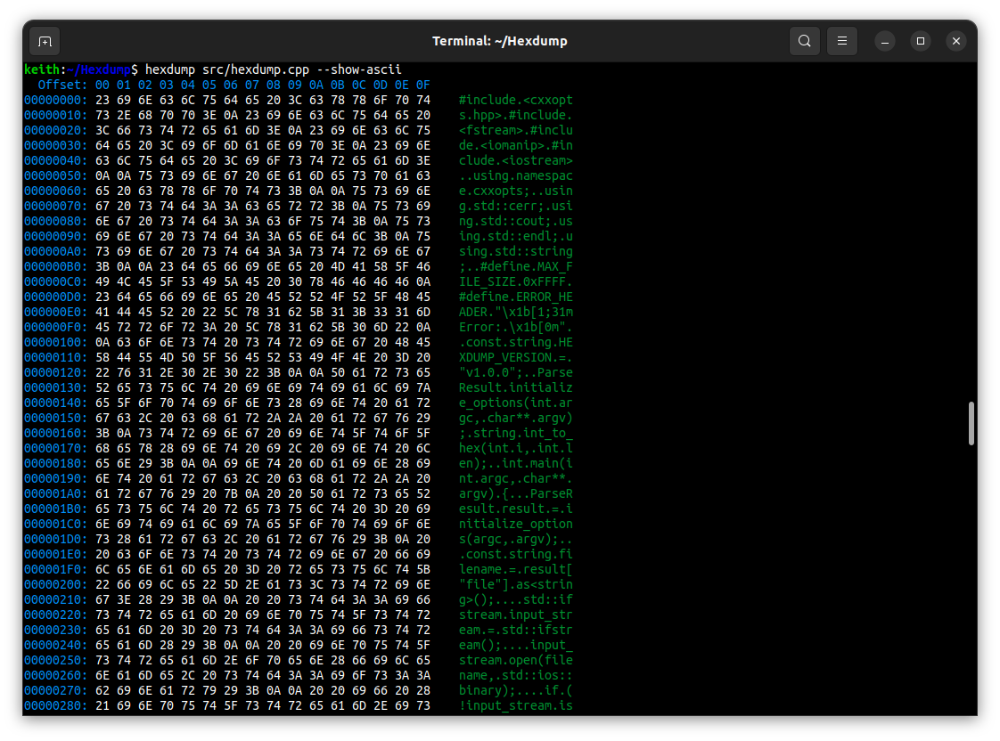

<div align="center">
  <br /><br />
  
  <br /><br />
</div>

----

<div id="user-content-toc" align="center">
  <ul>
    <summary><h1 style="display: inline-block;">Hexdump</h1></summary>
  </ul>

  <p>
    <i>the <b>alternative</b></i> cross platfrom hex dumping utility
    <br />
    <a href="https://github.com/KeithBrown39423/Hexdump/issues"><b>Report Bug</b></a>
    ·
    <a href="https://github.com/KeithBrown39423/Hexdump/issues"><b>Request Feature</b></a>
  </p>
</div>

<p align="center">
  <a href="#features">Features</a> ·
  <a href="#setup">Setup</a> ·
  <a href="#credits">Credits</a>
</p>

<br />

----

<br /><br />
<div align="center">
  
  ###### Hexdump v1.1.0
  
  
</div>

## Features
* ASCII sidebar
* Colored output
* Output to file

## Setup
<blockquote>
  <h1>Note</h1>

  **Hexdump** *is designed to replace the standard Hexdump command*.
  If you feel uncomfortable replacing it, simply rename the binary to something else.
</blockquote>

### Linux\:
Download the binary from the [release](https://github.com/KeithBrown39423/Hexdump/releases/) page. 

Place the Hexdump binary into: 
* `/bin/etc` ~ For system-wide access (requires administrator privileges)
* `~/bin` ~ For local access restricted to your user account (create the folder if it doesn't exist)

<br /><br />

### Windows:
Hexdump is compatible with Windows out-of-the-box, but there is no compiled binary of Hexdump in the releases.

You will have to compile it yourself using one of the following commands:
```bash
make build
# or
g++ -Wall -Werror -Wpedantic -O3 -I lib -I include src/hexdump.cpp -o bin/hexdump
```
After compiling, move the binary into `C:/Program Files/Hexdump/`
> **Note:** Don't forget to add `C:/Program Files/Hexdump/` to your PATH.

<br /><br />


<div id="user-content-toc" align="center">
  <ul>
    <summary><h1 style="display: inline-block;">CREDITS</h1></summary>
  </ul>
</div>

----

### Libraries
* [**cxxopts (v3.1.1)**](https://github.com/jarro2783/cxxopts/tree/v3.1.1) ~ for parsing command line arguments

<br />

### Contributors
Huge thank you to all the people who have contributed to this project:
<br /><br />
<a href="https://github.com/KeithBrown39423/Hexdump/graphs/contributors">
  
</a>

<p align="right">
  <sub>(<b>Hexdump</b> is protected by the <a href="https://raw.githubusercontent.com/KeithBrown39423/Hexdump/release/LICENSE"><i>MIT</i></a> licence)</sub>
</p>
